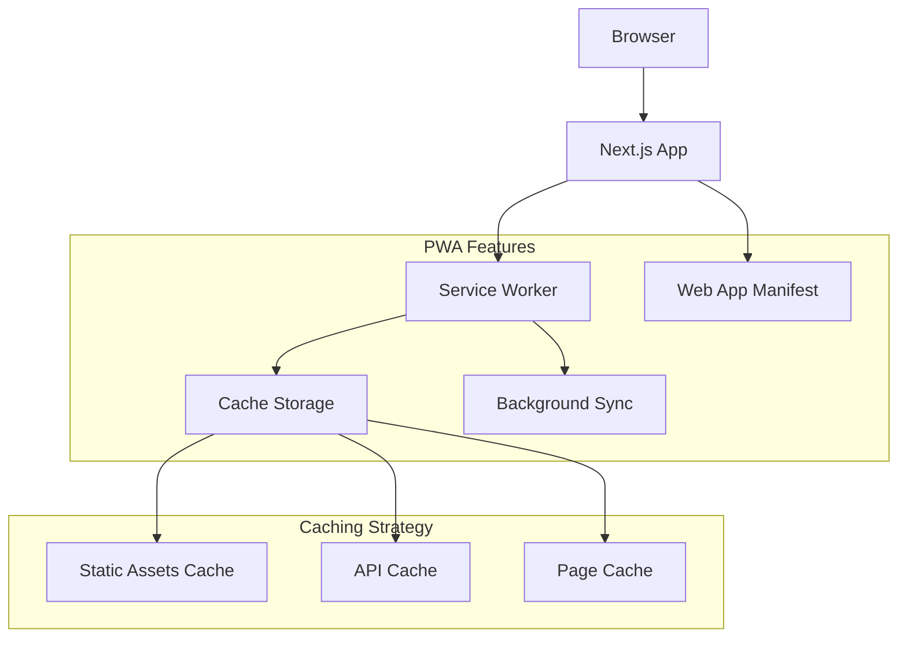

# PWA Conversion Design Document

## Overview

This design outlines the conversion of the existing Next.js portfolio website into a Progressive Web App (PWA). The implementation will leverage Next.js 14's built-in PWA capabilities combined with the `next-pwa` plugin to provide offline functionality, installability, and improved performance through strategic caching.

The design maintains the current single-page application structure while adding PWA features including service worker registration, web app manifest, caching strategies, and offline capabilities.

## Architecture

### High-Level Architecture



### Service Worker Strategy

The PWA will implement a multi-layered caching strategy:

1. **Precaching**: Critical static assets (CSS, JS, images, fonts)
2. **Runtime Caching**: Dynamic content and API responses
3. **Stale-While-Revalidate**: For frequently updated content
4. **Cache First**: For static assets that rarely change

### PWA Integration Points

- **Next.js App Router**: Seamless integration with existing routing
- **Metadata API**: Enhanced with PWA-specific meta tags
- **Static Assets**: Optimized caching for public folder contents
- **Dynamic Routes**: Intelligent caching for portfolio sections

## Components and Interfaces

### 1. PWA Configuration

**File**: `next.config.js`
- Configure `next-pwa` plugin
- Define workbox settings
- Set up build-time optimizations

**Interface**:
```typescript
interface PWAConfig {
  dest: string;
  register: boolean;
  skipWaiting: boolean;
  disable: boolean;
  runtimeCaching: RuntimeCachingRule[];
}
```

### 2. Web App Manifest

**File**: `public/manifest.json`
- App metadata and branding
- Display modes and orientations
- Icon definitions and sizes

**Interface**:
```typescript
interface WebAppManifest {
  name: string;
  short_name: string;
  description: string;
  start_url: string;
  display: 'standalone' | 'fullscreen' | 'minimal-ui';
  background_color: string;
  theme_color: string;
  icons: ManifestIcon[];
}
```

### 3. Service Worker Registration

**File**: `src/app/layout.tsx` (enhanced)
- Client-side service worker registration
- Update notifications
- Installation prompts

**Interface**:
```typescript
interface ServiceWorkerManager {
  register(): Promise<ServiceWorkerRegistration>;
  checkForUpdates(): Promise<boolean>;
  showInstallPrompt(): void;
  handleOfflineStatus(): void;
}
```

### 4. PWA Components

#### Install Prompt Component
```typescript
interface InstallPromptProps {
  onInstall: () => void;
  onDismiss: () => void;
  isVisible: boolean;
}
```

#### Offline Indicator Component
```typescript
interface OfflineIndicatorProps {
  isOffline: boolean;
  className?: string;
}
```

#### Update Notification Component
```typescript
interface UpdateNotificationProps {
  onUpdate: () => void;
  onDismiss: () => void;
  isVisible: boolean;
}
```

## Data Models

### Cache Configuration Model

```typescript
interface CacheConfig {
  name: string;
  pattern: RegExp;
  strategy: 'CacheFirst' | 'NetworkFirst' | 'StaleWhileRevalidate';
  expiration?: {
    maxEntries: number;
    maxAgeSeconds: number;
  };
}
```

### PWA State Model

```typescript
interface PWAState {
  isInstalled: boolean;
  isOffline: boolean;
  hasUpdate: boolean;
  installPromptEvent: BeforeInstallPromptEvent | null;
}
```

### Asset Manifest Model

```typescript
interface AssetManifest {
  precacheManifest: PrecacheEntry[];
  runtimeCaching: RuntimeCachingRule[];
  navigationFallback: string;
}
```

## Error Handling

### Service Worker Errors

1. **Registration Failures**
   - Graceful fallback to standard web functionality
   - Error logging for debugging
   - User notification for critical failures

2. **Cache Failures**
   - Network fallback when cache is unavailable
   - Partial content delivery when possible
   - Clear error messages for users

3. **Update Failures**
   - Retry mechanisms for failed updates
   - Rollback to previous working version
   - User notification of update status

### Offline Scenarios

1. **Complete Offline**
   - Serve cached content when available
   - Display offline indicator
   - Queue actions for when online

2. **Partial Connectivity**
   - Implement timeout strategies
   - Progressive enhancement approach
   - Background sync for failed requests

### Installation Errors

1. **Manifest Validation**
   - Comprehensive manifest validation
   - Fallback for missing icons
   - Clear error reporting

2. **Browser Compatibility**
   - Feature detection for PWA capabilities
   - Progressive enhancement for unsupported browsers
   - Graceful degradation strategies

## Testing Strategy

### Unit Testing

1. **Service Worker Logic**
   - Cache strategy implementations
   - Event handler functionality
   - Update mechanisms

2. **PWA Components**
   - Install prompt behavior
   - Offline indicator states
   - Update notification flow

3. **Utility Functions**
   - PWA detection logic
   - Cache management functions
   - Network status handling

### Integration Testing

1. **Cache Behavior**
   - End-to-end caching workflows
   - Cache invalidation scenarios
   - Cross-browser cache consistency

2. **Installation Flow**
   - Complete installation process
   - Post-installation behavior
   - Uninstallation handling

3. **Offline Functionality**
   - Offline content delivery
   - Background sync operations
   - Network recovery scenarios

### Performance Testing

1. **Load Time Metrics**
   - First Contentful Paint (FCP)
   - Largest Contentful Paint (LCP)
   - Time to Interactive (TTI)

2. **Cache Efficiency**
   - Cache hit rates
   - Storage usage optimization
   - Memory consumption

3. **Network Usage**
   - Bandwidth optimization
   - Background sync efficiency
   - Update download sizes

### PWA Audit Testing

1. **Lighthouse PWA Audit**
   - Achieve 90+ PWA score
   - Meet all PWA criteria
   - Optimize performance metrics

2. **Cross-Platform Testing**
   - iOS Safari behavior
   - Android Chrome installation
   - Desktop PWA functionality

3. **Accessibility Testing**
   - PWA-specific accessibility features
   - Offline state accessibility
   - Installation prompt accessibility

## Implementation Considerations

### Performance Optimizations

1. **Selective Caching**
   - Cache only essential resources initially
   - Implement lazy caching for secondary content
   - Regular cache cleanup and optimization

2. **Bundle Optimization**
   - Code splitting for PWA features
   - Tree shaking for unused PWA APIs
   - Minimize service worker size

3. **Network Strategies**
   - Intelligent prefetching
   - Adaptive caching based on connection
   - Background sync for non-critical updates

### Security Considerations

1. **HTTPS Requirement**
   - Ensure all PWA features work over HTTPS
   - Implement proper CSP headers
   - Secure service worker registration

2. **Cache Security**
   - Prevent cache poisoning
   - Implement proper cache validation
   - Secure sensitive data handling

### Browser Compatibility

1. **Progressive Enhancement**
   - Core functionality without PWA features
   - Feature detection for PWA capabilities
   - Fallback strategies for unsupported browsers

2. **Cross-Platform Considerations**
   - iOS-specific PWA limitations
   - Android installation behaviors
   - Desktop PWA variations